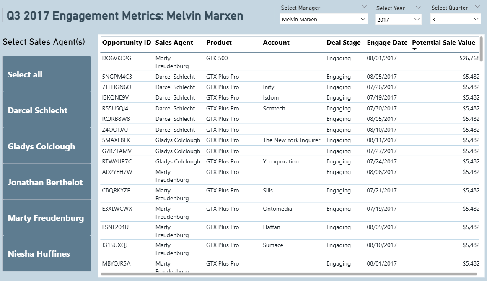
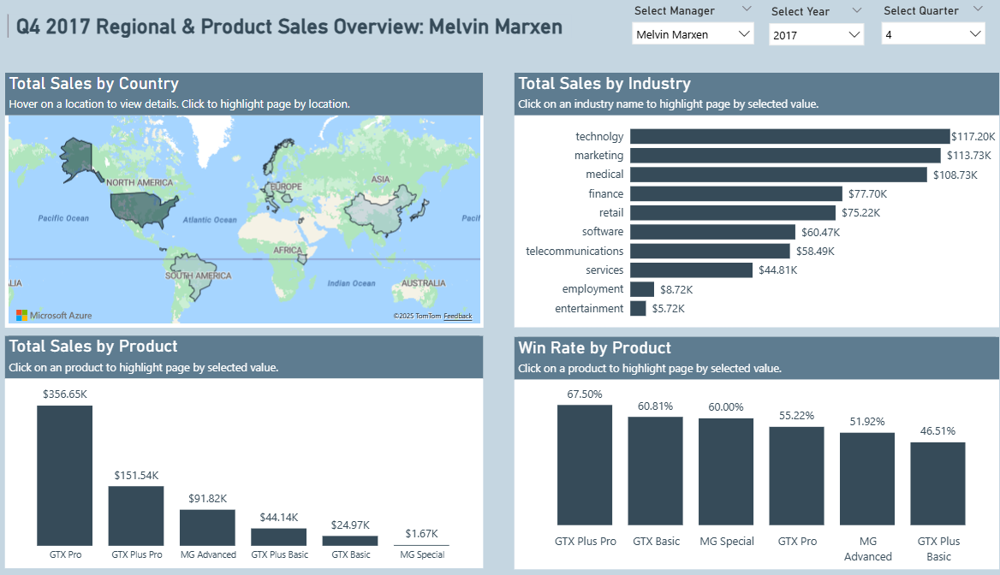
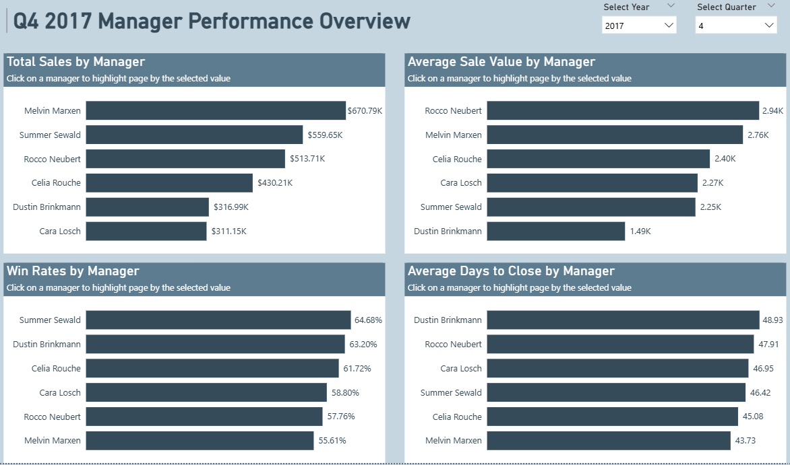
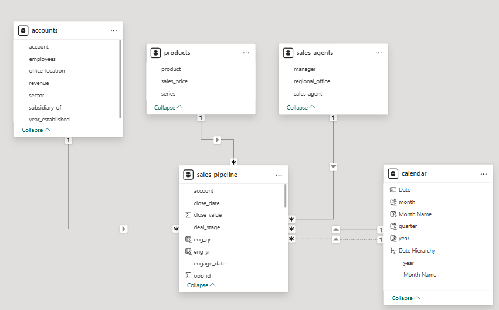

# CRM Sales Opportunities Dashboard
The project designs an interactive dashboard for sales team managers of a company selling computer hardware to large businesses to keep track of sales performance of their team. <br>





### Tech Stack: SQL (T-SQL) | Power BI | DAX
### SQL Techniques Used:
- Window Functions (AVG OVER PARTITION BY, RANK)
- CTEs for complex query organization
- Conditional Aggregation (CASE WHEN)
- Date Functions (DATEPART, DATEDIFF, CONCAT)
- Multi-table JOINs
- Type casting for accurate calculations
- Case-insensitive matching (LOWER)

## Business Problem:
The sales organization needed a centralized analytics solution to:
- **Track performance across 6 regional managers and their teams of sales agents**
- **Monitor key metrics (total sales, win rates, average deal values, and sales cycle length)**
- **Compare performance:** Identify top performers and underperformers relative to company averages
- **Analyze product mix:** Understand which products (GTX Pro, GTX Plus Pro, MG Advanced, etc.) drive revenue
- **Identify trends:** Track quarter-over-quarter growth and seasonal patterns
- **Pipeline visibility:** Monitor engaging opportunities and potential sales value
- **Geographic insights:** Understand sales distribution across countries and industries

## My Process
### 1. Data Import & Database Setup
I began by setting up a SQL Server database and importing the raw CSV data files:
**Database Architecture: created a relational database (crm_sales) with 4 normalized tables:**
- ``accounts`` table - Customer/company information
  - Fields: account name, sector, year_established, revenue, employees, office_location, subsidiary_of
  - Data types optimized: NVARCHAR for text, DECIMAL for revenue, INT for employees
- ``products`` table - Product catalog
  - Fields: product name, series, sales_price
  - Captures the 6 product lines (GTX Pro, GTX Plus Pro, MG Advanced, etc.)
- `sales_pipeline` table - Core fact table
  - Fields: opportunity_id (PK), sales_agent, product, account, deal_stage, engage_date, close_date, close_value
  - Captures full sales lifecycle from engagement to close
  - **opportunity_id** as primary key ensures data integrity
- `sales_agents` table - Sales team hierarchy
  - Fields: sales_agent, manager, regional_office
  - Links 30+ agents to 6 regional managers
#### Import Process:
- Used `BULK INSERT` for efficient data loading
- Specified field and row terminators for CSV parsing
- Set `FIRSTROW = 2` to skip CSV headers

#### Design Decisions:
- Normalized structure prevents data redundancy
- Primary key on opportunity_id ensures unique opportunities
- Foreign key relationships defined through shared columns (sales_agent, product, account)
- Data types sized appropriately (`NVARCHAR(50)` for names, `SMALLINT` for years, `DECIMAL(7,2)` for revenue)

**Code can be found in `data_importing.sql` file.**

### 2. Data Profiling
I conducted comprehensive data profiling across all four tables to assess data quality and identify potential issues:
- Validated row counts and checked for duplicate records
- Assessed NULL values across all critical fields (dates, values, identifiers)
- Verified referential integrity between tables using LEFT JOINs
- Analyzed date ranges to ensure logical timeframes
- Examined value distributions (min, max, avg) for numeric fields
- Cross-referenced dimension tables with fact table for consistency
- Investigated business logic of deal stages and their corresponding data patterns

#### Key Data Quality Issue Identified:
- **Inconsistent Product Naming:** Discovered "GTX Pro" vs "GTXPro" spelling inconsistency between sales_pipeline and products tables, which would cause issues when linking them together.<br>
Fixed using the following code:
```sql
UPDATE sales_pipeline
SET product = 'GTX Pro'
WHERE product = 'GTXPro'
```
#### Data Quality Assessment:
- 8,800 opportunity records validated 
- `NULL` values investigated and confirmed to represent valid business states (prospecting, engaging stages)
- Close values of $0 verified as appropriate for "Lost" deals
- All dimension tables (accounts, products, sales_agents) validated for completeness

**Conclusion: Dataset is production-ready with one standardization applied. All NULL values and anomalies have valid business justifications and were retained.** 

### 3. Exploratory Data Analysis (EDA)
With clean data in hand, I dove into EDA to uncover patterns, identify top performers, and understand what drives sales success. My approach combined statistical analysis with business context to generate actionable insights.<br>
Some of my findings include:
- **Revenue Trends**: I started by examining quarterly performance to identify seasonality patterns:  

    ```sql
    SELECT 
        CONCAT('Q',DATEPART(QUARTER,CLOSE_DATE),' ',DATEPART(YEAR,CLOSE_DATE)) AS quarter_year,
        SUM(CLOSE_VALUE) AS TOTAL_SALES,
        AVG(CLOSE_VALUE) AS AVG_SALE_VALUE
    FROM sales_pipeline 
    WHERE deal_stage='Won'
    GROUP BY CONCAT('Q',DATEPART(QUARTER,CLOSE_DATE),' ',DATEPART(YEAR,CLOSE_DATE))
    ORDER BY quarter_year ASC
    ```

    - **Finding:** Q2 2017 turned out to be the strongest quarter, bringing in $3.09M in revenue, which was 63% higher than Q1’s $1.13M and showed a clear mid-year spike in performance.

    
- **Top Performers**:  
    ```sql
    SELECT TOP 5
        t1.sales_agent, 
        t2.manager,
        SUM(close_value) AS total_sales,
        AVG(close_value) AS avg_sale_value,
        COUNT(DISTINCT opportunity_id) AS count_sales
    FROM sales_pipeline t1
    LEFT JOIN sales_agents t2 ON LOWER(t1.sales_agent)=LOWER(t2.sales_agent)
    WHERE deal_stage = 'Won'
    GROUP BY t1.sales_agent,t2.manager
    ORDER BY total_sales DESC
    ```

    - **Finding**: Darcel Schlecht dominated with $1.15M in closed revenue, more than 2x the second-place performer.


- **Win Rate Analysis**:  
    ```sql
    SELECT 
        t1.sales_agent,
        t2.manager,
        SUM(CASE WHEN deal_stage='Won' THEN 1 ELSE 0 END) AS won_opp,
        SUM(CASE WHEN deal_stage='Lost' THEN 1 ELSE 0 END) AS lost_opp,
        COUNT(*) AS total_opps,
        ROUND(CAST(SUM(CASE WHEN deal_stage='Won' THEN 1 ELSE 0 END) AS FLOAT) / COUNT(*) * 100, 2) AS win_rate,
        ROUND(CAST(SUM(CASE WHEN deal_stage='Lost' THEN 1 ELSE 0 END) AS FLOAT) / COUNT(*) * 100, 2) AS losing_rate
    FROM sales_pipeline t1
    LEFT JOIN sales_agents t2 ON LOWER(t1.sales_agent) = LOWER(t2.sales_agent)
    WHERE deal_stage IN ('Won','Lost')  
    GROUP BY t1.sales_agent,t2.manager
    ```

    - **Finding**: Win rates varied 51% to 68%. The 17-point spread represents massive coaching opportunity.


- **Pipeline Opportunity Analysis**:  
    ```sql
    SELECT
        t1.sales_agent,
        t3.manager,
        COUNT(opportunity_id) AS total_opportunities,
        SUM(t2.sales_price) AS total_potential_value
    FROM sales_pipeline t1
    LEFT JOIN products t2 ON t1.[product] = t2.[product]
    LEFT JOIN sales_agents t3 ON LOWER(t3.sales_agent) = LOWER(t1.sales_agent)
    WHERE t1.deal_stage = 'Engaging'
    GROUP BY t1.sales_agent, t3.manager
    ORDER BY total_opportunities DESC
    ```

    - **Finding**: Markita Hansen held highest potential value ($282.8K/79 deals) vs Vicki Laflamme's volume strategy (104 opportunities/$227.3K).


- **Product Performance using CTEs**:  
    ```sql
          WITH cte_product_sales AS (
          SELECT [product], 
              close_value,
              CASE WHEN deal_stage = 'Won' THEN 1 ELSE 0 END AS win_flag
          FROM sales_pipeline
          WHERE close_date IS NOT NULL)
      SELECT 
          [product], 
          SUM(close_value) AS total_sales,
          SUM(win_flag) AS Wins,
          AVG(CAST(win_flag AS FLOAT))*100 AS win_rate
      FROM cte_product_sales
      GROUP BY [product]
      ORDER BY total_sales DESC
    ```

    - **Finding**: GTX Pro led revenue ($3.51M/55% win rate) while MG Special had highest win rate (64.84%): price vs. conversion trade-off.
 
- **Manager Performance using Window Functions**:  
    ```sql
          WITH qtr_sales_by_manager AS (
          SELECT
              CONCAT('Q',DATEPART(QUARTER,CLOSE_DATE),' ',DATEPART(YEAR,CLOSE_DATE)) AS quarter_year,
              manager,
              SUM(close_value) AS Total_Sales
          FROM sales_pipeline AS sp
          LEFT JOIN sales_agents AS st ON sp.sales_agent = st.sales_agent
          WHERE close_date IS NOT NULL
          GROUP BY CONCAT('Q',DATEPART(QUARTER,CLOSE_DATE),' ',DATEPART(YEAR,CLOSE_DATE)), manager)
      SELECT *,
          AVG(Total_Sales) OVER(PARTITION BY quarter_year) AS company_avg,
          RANK() OVER(PARTITION BY quarter_year ORDER BY Total_Sales DESC) AS 'Rank'
      FROM qtr_sales_by_manager
      ORDER BY quarter_year, Total_Sales DESC
    ```

    - **Finding**: Rankings fluctuated quarterly, window functions revealed consistency champions vs. volatile performers.

The rest of the EDA can be found in `EDA.sql`.

### 4. Data Modeling
First, I connected to the data in Power BI using the SQL Server connector through Import Mode.<br>
I designed a star schema in Power BI optimized for performance, with one-to-many relationships between the dimension and fact tables respectively. A calendar table was created to enable time series analysis such as quarter-on-quarter growth, with `close_date` as the active relationship and `engage_date` as an inactive relationship.


### 5. DAX Measures Development
I then created a variety of measures and calculated columns using DAX, including but not limited to:
- **QoQ Sales Growth**:
  ```
    QoQ Sales Growth = 
    var SalesLastQtr = CALCULATE(sum('sales_pipeline'[close_value]),DATEADD('Calendar'[Date], -1, QUARTER))
    return divide(sum('sales_pipeline'[close_value])-SalesLastQtr,SalesLastQtr)
    ```
- **Win Rate**:
    ```
    Total Wins = CALCULATE(COUNTROWS('sales_pipeline'),FILTER('sales_pipeline','sales_pipeline'[deal_stage] = "Won"))
    ```
    ```
        Win Rate = 
        VAR Losses =  CALCULATE(COUNT([opportunity_id]), sales_pipeline[deal_stage]="Lost")
        RETURN DIVIDE([Total Wins], [Total Wins] + Losses)
    ```
- **Potential Sales**:
  ```
    Potential Sales = 
    CALCULATE(
    SUMX(FILTER('sales_pipeline','sales_pipeline'[deal_stage] = "Engaging"),RELATED('products'[sales_price])),REMOVEFILTERS('Calendar'))
  ```

  The rest of the DAX code can be found in the `CRM_sales_opps.pbix` file.

### 6. Dashboard Design & Development
I built a 5-page interactive dashboard with strategic layout and user experience:

  - **Page 1: Performance Overview**
    - You can filter by manager name and the timeframe (year or quarter) to get an overview of the manager's performance during the specified quarter.
    - Comparative Metrics: Company averages displayed alongside manager metrics
    - Clicking on the "Click to see details" button navigates to the Engagement Opportunities page shown in point (2).
      
  - **Page 2: Engagement Opportunities**
    - Details of all deals with potential, where the `deal_stage = 'Engaging'`.
    - Slicers to filter by manager name, the timeframe (year or quarter), and sales agent.
      
  - **Page 3: Sales Trends Analysis**
    - Monthly analysis for sales and win rates, with company average as a comparative metric/benchmark.
    - Also shows the top 5 largest deals closed and the highest-value customers.
      
  - **Page 4: Regional and Product Analysis**
    - Total sales by country, product, and industry.
      
  - **Page 5: Manager Performance Comparison**
    - 4 comparison charts: total sales by manager, average sale value per manager, win rates by manager, and average days to close by manager.
      

  
